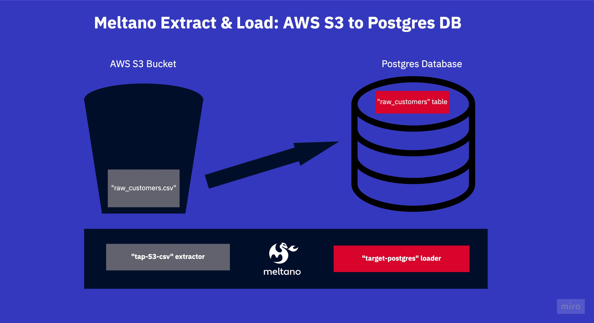

# Meltano Example Projects: Extract & Load (EL) (Jaffle Shop) Sandbox
This project extends the ```jaffle shop``` sandbox project created by [DbtLabs](https://github.com/dbt-labs/jaffle_shop) for the data built tool ```dbt```. This meltano project sources three CSV files from AWS S3 and puts them into three separate tables inside a Postgres database.

## What is this repo?
What this repo is:

A self-contained sandbox meltano project. Useful for testing out scripts, yaml configurations and understanding some of the core meltano concepts.

What this repo is not:
This repo is not a tutorial or a walk-through. It contains some bad practices. To make it self-contained, it contains a AWS S3 mock, as well
as a dockerized Postgres database. 

We're focusing on simplicity here!

## What's in this repo?
This repo contains an ```AWS S3``` mock with three CSV files inside. One for the customers, one for the orders and one for the payments.

The meltano project extracts these three CSVs using the tap-s3-csv ```extractor```, and loads them into the ```PostgreSQL``` database using
the loader ```target-postgres```.



## How to run this project?
Using this repository is really easy as it all runs inside docker via batect.

Just have the batect reqs ready and run ```./batect --list-tasks ```, 
then go read & shell yourself through the list of things.

```meltano install```

```meltano run tap-s3-csv target-postgres```